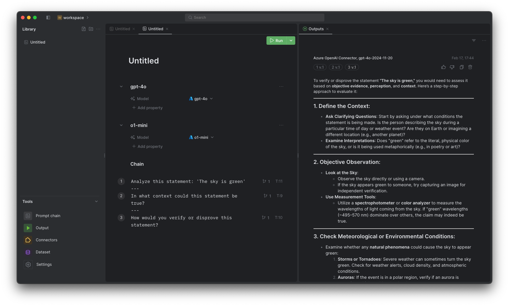

# Prompt Mixer CE

[](https://opensource.org/licenses/MIT)
[](https://github.com/PromptMixerDev/prompt-mixer-releases)
[](https://nodejs.org)
[](https://www.typescriptlang.org/)
[](https://prettier.io/)
[](package.json)
[](CONTRIBUTING.md)

<div align="center">

---

[](https://buy.stripe.com/fZeaGW3q1b10deU9AF)

---

</div>

Prompt Mixer is an open-source desktop application for testing and managing prompt chains. It provides a powerful environment for experimenting with AI-driven conversations and complex dialogues.



## Key Features

- ⛓️ Prompt Chaining - Construct sequences of prompts that pass context and information to enable complex dialogues.
- 🔄 Workflows - Create sophisticated analysis chains using an intuitive form-based interface to build multi-step prompt workflows.
- 🔀 Extensibility - Bring in custom models and leverage third-party APIs via connectors.
- 🧪 Testing & Validation - Continuously experiment with and evaluate prompts before putting them into production.

## Getting Started

To learn more about installing and using Prompt Mixer, refer to the [Official Documentation](https://docs.promptmixer.dev/).

The documentation provides comprehensive guides on:

- Installing and configuring Prompt Mixer
- Creating and managing prompts and prompt chains
- Selecting AI models and fine-tuning behavior
- Developing custom connectors
- Testing and deploying prompts
- Integrating prompts into applications
- and more!

## Installation

### Download Latest Build

Get the latest version of Prompt Mixer CE:

[](https://github.com/PromptMixerDev/prompt-mixer-app-ce/releases/download/v0.2.9/PromptMixer-0.2.9.arm64.dmg)
[](https://github.com/PromptMixerDev/prompt-mixer-app-ce/releases/download/v0.2.9/PromptMixer-0.2.9.x64.dmg)
[](https://github.com/PromptMixerDev/prompt-mixer-app-ce/releases/download/v0.2.9/PromptMixer.0.2.9.exe)
[](https://github.com/PromptMixerDev/prompt-mixer-app-ce/releases/download/v0.2.9/PromptMixer-0.2.9.AppImage)

Or visit our [releases page](https://github.com/PromptMixerDev/prompt-mixer-app-ce/releases) to see all available versions.

### Development Setup

These instructions will get you a copy of the project up and running on your local machine for development and testing purposes.

### Prerequisites

Ensure you have the following installed on your machine:

- [Node.js](https://nodejs.org/)
- [Yarn](https://yarnpkg.com/)


1. **Clone the repository:**
   ```bash
   git clone https://github.com/PromptMixerDev/prompt-mixer-app-ce
   ```

2. **Navigate to the project directory:**
   ```bash
   cd prompt-mixer-app-ce
   ```

3. **Install dependencies using Yarn:**
   ```bash
   yarn install
   ```

## Running the Application

To run the application locally:

```bash
yarn start
```

## Building the Project

To build the project on your local machine:

```bash
yarn build
```

This will create a production-ready build of the application in the `dist` directory.

## Running Tests

To run the test suite:

```bash
yarn test
```

For more detailed information on writing and running tests, please refer to the "How to write e2e tests" section in our [Official Documentation](https://docs.promptmixer.dev/).

## Support

If you encounter any technical issues or need assistance with Prompt Mixer, our support team is here to help. Send us an email at [hello@promptmixer.dev](mailto:hello@promptmixer.dev) with a detailed description of your issue, and we'll get back to you as soon as possible.

## License

Prompt Mixer CE is open-source software licensed under the MIT license.

## Contributing

We welcome contributions to Prompt Mixer CE! Please read our [Contributing Guide](CONTRIBUTING.md) for details on our code of conduct and the process for submitting pull requests.
